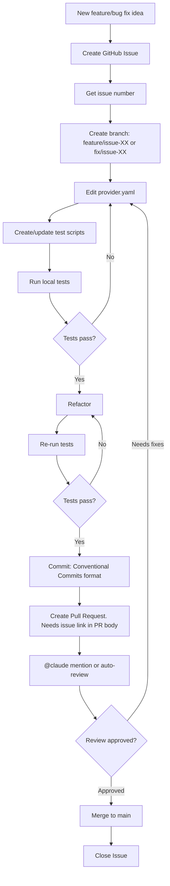
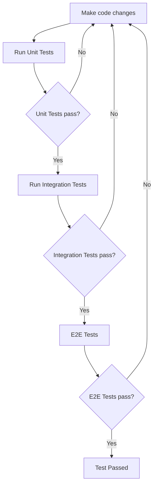

# CLAUDE.md

This file provides guidance to Claude Code (claude.ai/code) when working with code in this repository.

## Project Overview

Podman provider implementation for DevPod. DevPod is an open-source client-side development environment management tool, and this provider manages workspaces using the Podman container engine.

## Project Structure

```text
podman-provider/
├── provider.yaml           # DevPod provider definition (466 lines, single implementation file)
│                           # All logic is embedded in exec.init section
├── tests/                  # Test suite
│   ├── test_init_script.sh          # Unit tests for init script
│   ├── integration_test.sh          # DevPod integration tests
│   ├── test_mismatch_detection.sh   # Resource mismatch detection tests
│   ├── README.md                    # Test execution guide (English)
│   └── README.ja.md                 # Test execution guide (Japanese)
├── .github/workflows/
│   ├── claude.yml                   # Claude Code integration (@claude mentions)
│   └── claude-code-review.yml       # Automatic code review
├── .claude/
│   └── settings.local.json          # Claude Code permission settings
├── README.md              # User documentation (English, primary)
├── README.ja.md           # User documentation (Japanese)
├── CLAUDE.md              # Developer guide (this file)
└── CHANGELOG.md           # Version history
```

**Key Design Decisions**:

- **Single-file implementation**: All functionality is embedded in `provider.yaml`'s `exec.init` script (lines 77-463)
- **Test-driven**: Test scripts exist for each feature
- **Multi-language documentation**: README files available in English (primary) and Japanese
- **Empty directory**: `podman/` is currently unused (reserved for future extensions)

## Multi-Language Documentation

### File Structure

- `README.md`: Primary documentation in English (for global audience)
- `README.ja.md`: Japanese version (for Japanese-speaking users)
- `tests/README.md`: Test documentation in English
- `tests/README.ja.md`: Test documentation in Japanese

### Maintaining Translations

When updating documentation:

1. **Always update both language versions** when making changes
2. **Keep structure identical** between language versions for easier synchronization
3. **Code examples must be identical** (no translation needed)
4. **Update language selection links** if adding new languages
5. **In commits and PRs, use English** for commit messages and descriptions

### Translation Guidelines

**Technical Terminology**:
- Keep technical terms consistent (Machine, workspace, provider, etc.)
- Use the glossary defined in this document
- Cross-reference with Podman/DevPod official documentation

**Quality Checklist**:
- [ ] All technical terms consistent with glossary
- [ ] Code blocks identical in both versions
- [ ] Links functional in both versions
- [ ] Language selection links point to correct files
- [ ] Both versions committed in same commit
- [ ] Section structure matches between versions

### Translation Glossary

For consistency in translations between English and Japanese documentation, refer to the translation glossary:

- **File**: `.claude/skills/translate/glossary.md`
- **Usage**: Read this file when working on documentation translations or when verifying terminology consistency

**When to use**:
- Before translating or updating multi-language documentation
- When verifying technical term consistency across README.md and README.ja.md
- When adding new technical terms to the project

### Using the Translation Skill

This project includes a custom Claude Code skill for automated translation:

**Command**:

```bash
/translate <filename> <source-lang-code> <target-lang-code>
```

**Language codes**: `en` (English), `ja` (Japanese)

**Examples**:

```bash
# Translate README from English to Japanese
/translate README.md en ja

# Translate test guide from Japanese to English
/translate tests/README.ja.md ja en
```

**What the skill does**:

- Automatically applies the translation glossary (`.claude/skills/translate/glossary.md`)
- Preserves code blocks and links
- Maintains section structure between language versions
- Runs quality checks before completion

**Files**:

- Skill definition: `.claude/skills/translate/SKILL.md`
- Translation examples: `.claude/skills/translate/examples.md`
- Translation glossary: `.claude/skills/translate/glossary.md` (56 software development terms)

## Development Workflow

This project follows Issue Driven Development (IDD).

### Development Process



### Key Principles

1. **Create issue for all changes**: Features, bug fixes, documentation updates - everything

2. **Branch naming convention**: `feature/issue-XX-short-description` or `fix/issue-XX-short-description`

3. **Tests required**: Add or update tests corresponding to changes

4. **Refactoring phase**: After tests pass, refactor code and re-run tests before committing

5. **Conventional Commits compliance**: All commit messages follow Conventional Commits format in English

### Commit Message Format

**Basic structure**:

```text
<type>: <subject>

<body>

Refs: #<issue-number>
```

**Types**:

- `feat`: New feature
- `fix`: Bug fix
- `docs`: Documentation only changes
- `refactor`: Refactoring (no functionality change)
- `test`: Adding or fixing tests
- `chore`: Build process or tooling changes

**subject**: Concise description of change (max 50 chars, imperative mood, lowercase start, no period)

**body**:

- Why this change was made (Why)
- What side effects exist (Side effects)
- One blank line before body
- Wrap at 72 characters

**Example**:

```text
feat: add automatic resource update with podman machine set

This change implements non-destructive resource updates using the
`podman machine set` command instead of recreating the machine.

Why: Users reported data loss during machine recreation when updating
CPU or memory settings.

Side effects: Requires Podman v4.0 or later. Disk size can only be
increased, not decreased.

Refs: #42
```

1. **Link issue in PR**: Include `Closes #XX` or `Fixes #XX` in PR body

## Running Tests



### Unit Tests

```bash
# Test init script (platform detection, machine management)
cd tests
./test_init_script.sh

# Test resource mismatch detection logic
./test_mismatch_detection.sh
```

### Integration Tests

```bash
# Integration test as DevPod provider
# Prerequisites: devpod and podman installed
cd tests
./integration_test.sh
```

### E2E Tests

```bash
set -e
# Clean up existing podman provider
if [ -n "$(devpod provider list | grep podman)" ]; then 
    devpod provider delete podman;
fi
# Register local provider
devpod provider add ./provider.yaml
devpod provider use podman

# Create sample workspace
devpod up https://github.com/loft-sh/devpod-example-go --provider podman
```

See `tests/README.md` for detailed test scenarios.

## Linting

Only YAML file linting is used:

```bash
# YAML lint command (project-specific command not yet defined)
yamllint .
```

## GitHub Actions Integration

### Claude Code Workflow

**Triggers**:

- `@claude` mention in issues or comments
- `@claude` mention in pull request reviews
- `@claude` in issue title/body when creating issues

**Permissions**:

- `.claude/settings.local.json` defines allowed scopes for local development
- Current permissions: `devpod provider`, `podman machine`, test script execution

**File**: `.github/workflows/claude.yml`

### Automatic Code Review

**Trigger**: Pull request creation/update (opened, synchronize, ready_for_review, reopened)

**Behavior**: Claude Code's code-review plugin automatically reviews code

**File**: `.github/workflows/claude-code-review.yml`

## Troubleshooting

### provider.yaml Syntax Errors

**Symptom**: DevPod cannot load provider

**Diagnosis**:

```bash
# Check with YAML lint
yamllint provider.yaml

# Check error message when adding provider
devpod provider add ./provider.yaml
```

### init Script Failures

**Symptom**: Error during `devpod up` execution

**Diagnosis**:

```bash
# Run script directly for testing
cd tests
./test_init_script.sh

# Test with environment variables set
export PODMAN_MACHINE_AUTO_INIT=true
./test_init_script.sh
```

### Machine Name Detection Issues

**Symptom**: "VM does not exist" error

**Cause**: Pre-v0.2.1 version without asterisk removal support

**Solution**:

```bash
# Explicitly specify machine name
devpod provider set-options podman PODMAN_MACHINE_NAME=<machine-name>
```

### Resource Update Failures

**Symptom**: `podman machine set` command error

**Diagnosis**:

```bash
# Check Podman version (machine set requires v4.0+)
podman --version

# Verify machine is stopped
podman machine stop <machine-name>
```

## DevPod Provider Structure

DevPod providers are defined in `provider.yaml` file. Main components:

### provider.yaml Key Sections

1. **Metadata**: name, version, description, icon (optional)
2. **options**: User-configurable provider options (passed as environment variables)
3. **agent**: Provider settings (driver, inactivityTimeout, credentials injection, etc.)
4. **binaries**: Additional helper binaries required for provider execution
5. **exec**: Commands DevPod executes to interact with environment
   - `command`: Required - defines how to execute commands in environment
   - `init`, `create`, `delete`: Optional commands

### Podman-Specific Considerations

- **Platform differences**: macOS requires Podman Machine VM management, Linux connects directly to container daemon
- **driver setting**: agent.driver uses `docker` compatibility mode (docker CLI compatible)
- **Machine management**: macOS environments implement automatic machine management in `exec.init` script

### Modifying provider.yaml - Important Notes

#### 1. Bash Script Embedding Constraints

- Bash scripts (`exec.init`) in YAML are embedded as string literals
- Pay attention to indentation and escaping (especially heredocs)
- Syntax errors not detected until DevPod execution, so testing is essential

#### 2. Environment Variable References

- Reference values defined in `options` with `${VARIABLE_NAME}` format
- DevPod expands these as environment variables at runtime
- Undefined variables become empty strings (recommend setting default values)

#### 3. Platform Branching

- `[[ "$OSTYPE" == "darwin"* ]]` branches for macOS/Linux
- Only macOS requires Podman Machine management
- Linux connects directly to Podman daemon

#### 4. Error Message Design

- Include manual resolution steps and automation options for all errors
- Output errors to stderr (`>&2 echo`)
- Make failures explicit with `exit 1`

#### 5. Test Updates

- Update `tests/test_init_script.sh` when changing `exec.init`
- Update `tests/integration_test.sh` when adding new options
- Update `tests/test_mismatch_detection.sh` when changing resource detection logic

## Reference Resources

- [DevPod Provider Quickstart](https://devpod.sh/docs/developing-providers/quickstart)
- [Provider Configuration](https://devpod.sh/docs/developing-providers/agent)
- [Provider Options](https://devpod.sh/docs/developing-providers/options)
